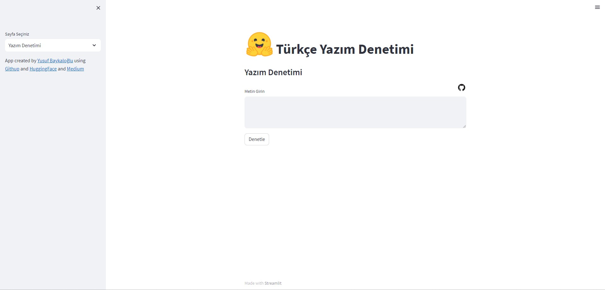

# Turkish SpellChecker


<div align="center" style="margin-top: 50px;">
  
</div>


### TR


Proje, Türkçe metinlerdeki yazım hatalarını düzeltmek ve metinler üzerinde ön işleme adımlarını bir araya getirerek açık kaynaklı bir şekilde toplumsal fayda sağlamak amacıyla gerçekleştirilmiştir. Proje, temelde iki aşamadan oluşmaktadır. Birinci aşamada, Türkçe bir metin girildiğinde, kod parçacıkları içinde bulunan fonksiyonlar kullanılarak düzeltilmiş metin çıktısı elde edilir. Diğer aşamada ise, verilen metinler üzerinde ön işleme adımlarının fonksiyonları bulunmaktadır. Toplam 11 adet ön işleme fonksiyonu bulunurken, ayrıca girdi olarak verilen metnin istatistiklerini sağlayan bir fonksiyon da bulunmaktadır. Türkçe yazım denetimi projesi kapsamında, kaynak olarak StarlangSoftware şirketinin Türkçe morfolojik analiz kodları kullanılmıştır.

### EN
This project has been developed to provide open-source social benefit by correcting spelling errors in texts given as input in Turkish and by performing preprocessing steps on the texts. The project consists of two main stages. In the first stage, when a Turkish text is entered, it goes through the functions within the code snippets, and an output of the corrected text is obtained. In another stage, there are functions for preprocessing on the given texts. While there are 11 preprocessing functions, there is also a function that provides statistics about the input text. The Turkish spell checking project utilizes the Turkish morphological analysis codes from the Starlang Software company as a source.


## Download Code

In order to work on code, create a fork from GitHub page. Use Git for cloning the code to your local or below line for Ubuntu:

```
git clone  https://github.com/yusufbaykal/TurkceYazimDenetim.git
```

Go to the project directory

```
cd TurkceYazimDenetim
```
Install the required packages


```
pip install setup.py
```

### Streamlit Run

```
cd .\YazımDenetim\

streamlit run streamlit_app.py
```
